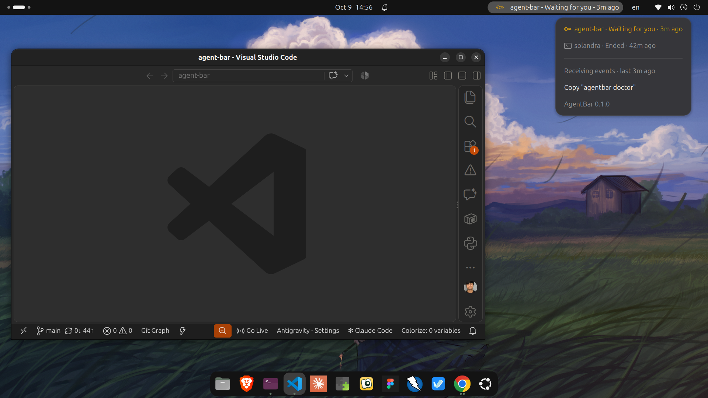

# AgentBar

AgentBar shows what your Claude Code sessions are doing in the GNOME top bar,
so you can work in another window and still know when Claude needs you.

In the top-right corner of GNOME, AgentBar looks like this:



- **Top bar:** the session that matters most, its state, and how long ago it
  last did something, plus `+N` for other sessions that are working.
- **Menu:** every session with its project, state, and time, plus a health
  line that says whether events are arriving. Click a session to bring its
  terminal or editor window to the front.
- **Notifications:** one banner when Claude needs permission, is waiting for
  you, finishes a turn, or a turn fails. Nothing for routine work.
- **Honest states:** a session with no news for 10 minutes says "No updates"
  instead of guessing, and a closed Claude terminal reads "Ended". AgentBar
  never shows a progress percentage, because Claude Code does not report one.

Everything stays on your machine. No account, no server, no telemetry.

**Status: beta (0.2.0).**

## What you need

| | Supported |
| --- | --- |
| OS | Ubuntu 26.04 LTS |
| Desktop | GNOME Shell 50, Wayland (the Ubuntu default) |
| Claude Code | 2.1.29x (tested). Other versions are untested |
| Node.js | Ubuntu's `nodejs` package, installed for you by `apt` |

Other distributions with GNOME Shell 50 may work but are untested. The exact
machines AgentBar was tested on are listed in
[os/linux/SUPPORT.md](os/linux/SUPPORT.md).

## Install

1. **Download** `agentbar_<version>_all.deb` from the
   [Releases page](https://github.com/ameghcoder/agent-bar/releases).

2. **Install the package.** This also installs `nodejs` if it is missing.

   ```sh
   sudo apt install ./agentbar_<version>_all.deb
   ```

3. **Connect Claude Code.** The first command only shows what would change;
   the second applies it, after saving a backup of your settings next to them.
   Your other settings and hooks are kept.

   ```sh
   agentbar install-hooks
   agentbar install-hooks --apply
   ```

4. **Restart Claude Code**, so it loads the new hooks.

5. **Log out and log back in.** GNOME only discovers a newly installed
   extension at login. Until then, `gnome-extensions` reports that the
   extension "does not exist". That is expected, not an error.

6. **Turn the extension on** (or use the Extensions app):

   ```sh
   gnome-extensions enable agentbar@ameghcoder.github.io
   ```

7. **Check everything.**

   ```sh
   agentbar doctor
   ```

   Every check should say `PASS`. Right after installing, before Claude has
   run anything, "State directory" and "State snapshot" say `WARN` because no
   event has arrived yet; they turn `PASS` after the first one.

Use Claude Code as usual. The top bar updates within a second of each event.

### When does each step take effect?

| You did | Takes effect |
| --- | --- |
| Installed or upgraded the package | Commands: immediately. Extension: after you log out and in |
| Ran `agentbar install-hooks --apply` | After you restart Claude Code |
| Enabled the extension | Immediately (once GNOME has found it at login) |

## Upgrade

Install the newer `.deb` the same way, then log out and in so GNOME loads the
new extension code:

```sh
sudo apt install ./agentbar_<new-version>_all.deb
agentbar install-hooks --apply   # usually "Nothing to change"; safe to run
```

Reinstalling a file with the *same* version number needs
`sudo apt install --reinstall ./agentbar_<version>_all.deb`.

## Uninstall

Three separate steps, from least to most thorough:

1. **Disconnect Claude Code.** Removes only the hooks AgentBar added, after a
   backup; your other settings and hooks stay. Then restart Claude Code.

   ```sh
   agentbar uninstall-hooks --apply
   ```

2. **Remove the package.** Deletes the commands and the extension. It never
   touches your Claude settings or AgentBar's data.

   ```sh
   sudo apt remove agentbar
   ```

3. **Optional: delete AgentBar's data.**

   ```sh
   rm -r ~/.local/state/agentbar
   rm ~/.claude/settings.json.agentbar-backup-*   # only once you no longer need the backups
   ```

## What the top bar says

| Text | Meaning |
| --- | --- |
| `Working` | Claude is running tools. A failed command is routine, so it stays Working |
| `Waiting for you` | Claude is waiting for your input or asked you a question |
| `Permission needed` | Claude is asking to run something |
| `Turn complete` | Claude finished responding. The project may not be done |
| `Failed` | The turn itself failed, for example an API error |
| `No updates` | No event for 10 minutes. Claude may still be busy with a long command; the menu says "Claude open" if its process is alive |
| `Ended` | The Claude process is gone (terminal closed, crash) |
| `AgentBar - No sessions` | Nothing captured yet, or every session is older than 24 hours |

## Troubleshooting

| Problem | Fix |
| --- | --- |
| `gnome-extensions` says the extension does not exist | Log out and back in once after installing |
| The top bar never changes | Run `agentbar doctor`. If "Claude hooks" fails, run `agentbar install-hooks --apply` and restart Claude Code |
| A session stays "No updates" | Normal during a long command. If Claude really closed, it turns "Ended" within about 10 seconds |
| The menu says "State unavailable" | `agentbar doctor` names the problem with the state file. AgentBar never overwrites a file it cannot read |
| Clicking a session does nothing | AgentBar only brings a window forward when it is sure which one. With several terminal windows it needs the project name in the window title |

`agentbar doctor` output contains no project names, prompts, or settings
content, so it is safe to paste into a bug report. To report a problem, open a
[bug report](https://github.com/ameghcoder/agent-bar/issues/new?template=bug_report.yml);
the form asks for exactly what is needed and nothing private.

## Privacy and your data

- AgentBar reads only what Claude Code passes to its hooks, plus the small
  `/proc/<pid>/stat` file of the Claude process, to see whether it is still
  running. It never reads your Claude transcripts.
- The top bar and notifications show only project names and fixed state words,
  never your prompts, commands, file contents, or paths.
- No network access, ever. Nothing is sent anywhere.

Files AgentBar writes (all readable only by you):

| File | What is in it |
| --- | --- |
| `~/.local/state/agentbar/state.json` | One entry per session from the last 24 hours: session ID, project name and path, state, a one-line last message, times, and the Claude process ID |
| `~/.local/state/agentbar/events.jsonl` | Every hook event, **including the full payload Claude Code sent**: the commands Claude ran, tool input and output (which can include file contents), and the path to its transcript. Kept for diagnosis and never shown in the UI. When it reaches about 10 MB it is renamed to `events.jsonl.1` (replacing the previous one) and a new file starts, so history uses at most about 20 MB |
| `~/.claude/settings.json.agentbar-backup-<time>-<id>` | A copy of your Claude settings, made by `install-hooks --apply` and `uninstall-hooks --apply` whenever a settings file already exists |

Treat `events.jsonl` like your shell history: do not attach it to bug reports.
Deleting it is safe at any time; AgentBar starts a new one.

## Known limitations

- Nothing is captured between your prompt and Claude's first tool call, so a
  session that is only thinking still shows its previous state.
- Whether you allowed or denied a permission is not observed; the next event
  replaces the "Permission needed" state.
- Parallel tool calls are not combined; the latest event wins.
- Detecting a closed terminal ("Ended") needs Linux and a Claude Code that
  passes its process ID to hooks (current versions do). Without it the session
  goes "No updates" after 10 minutes and disappears after 24 hours.
- Clicking a session brings its window forward but cannot pick a specific
  terminal tab.
- A failed turn (`StopFailure`) is mapped from Claude Code's documentation and
  tests; it has not yet occurred in a live session.

## For developers

AgentBar is TypeScript (capture, CLI, presentation) plus a GJS GNOME Shell
extension, connected only by a local JSON file.

- [docs/how-it-works.md](docs/how-it-works.md): the whole flow, with diagrams.
- [docs/development.md](docs/development.md): build, test, run the extension
  from a checkout, and build the `.deb`.
- [docs/architecture.md](docs/architecture.md): module boundaries and the exact
  presentation rules.
- [docs/adr/](docs/adr/): the decisions behind the design.
- [docs/testing.md](docs/testing.md): the release check.
- [docs/support.md](docs/support.md): getting help, known issues, and how
  reports are triaged.
- [CONTRIBUTING.md](CONTRIBUTING.md) and [SECURITY.md](SECURITY.md).
- [contract/](contract/): the language-neutral data contract.
- Adding support for another coding agent? Start with
  [agents/README.md](agents/README.md).

## License

MIT. See [LICENSE](LICENSE).
