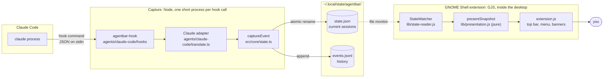
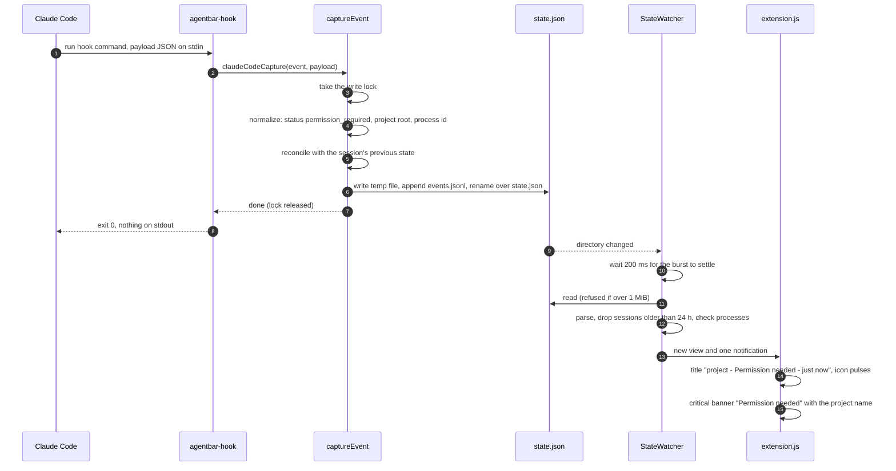
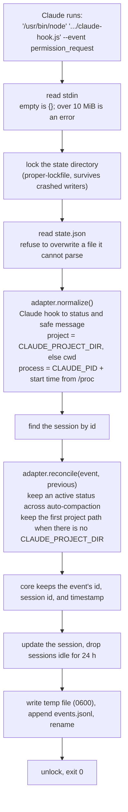
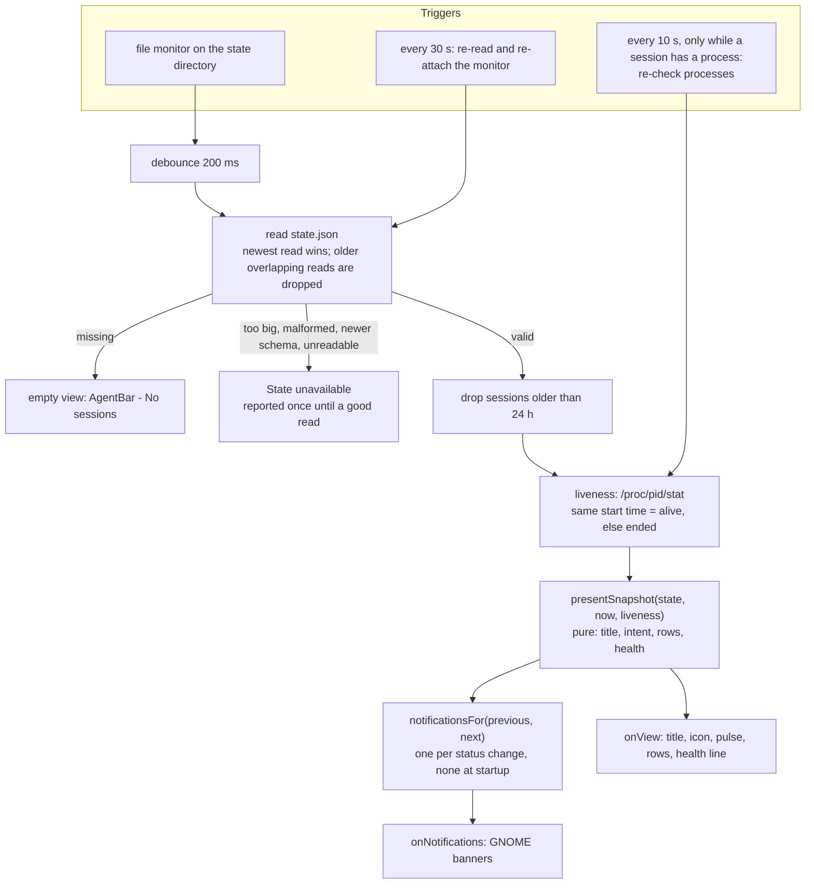
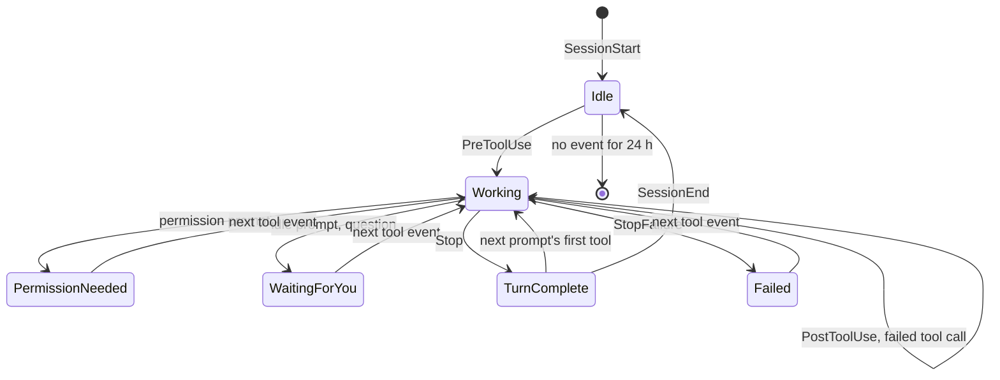
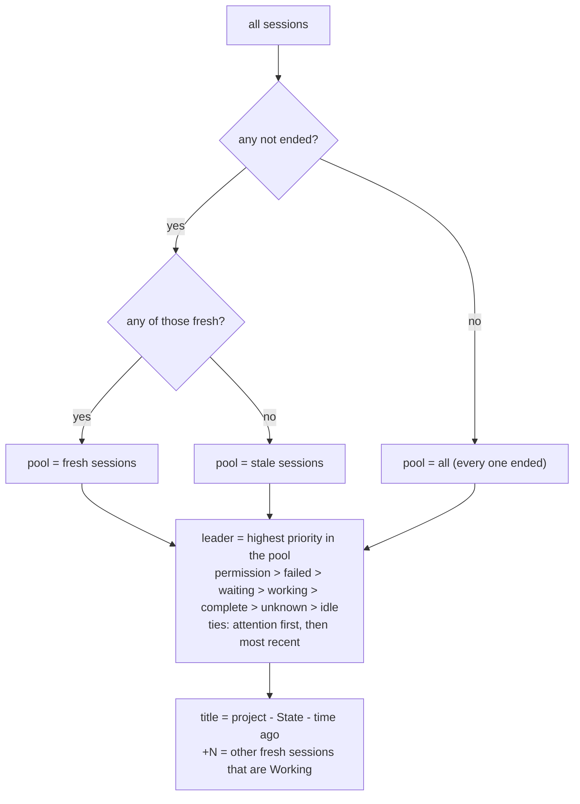
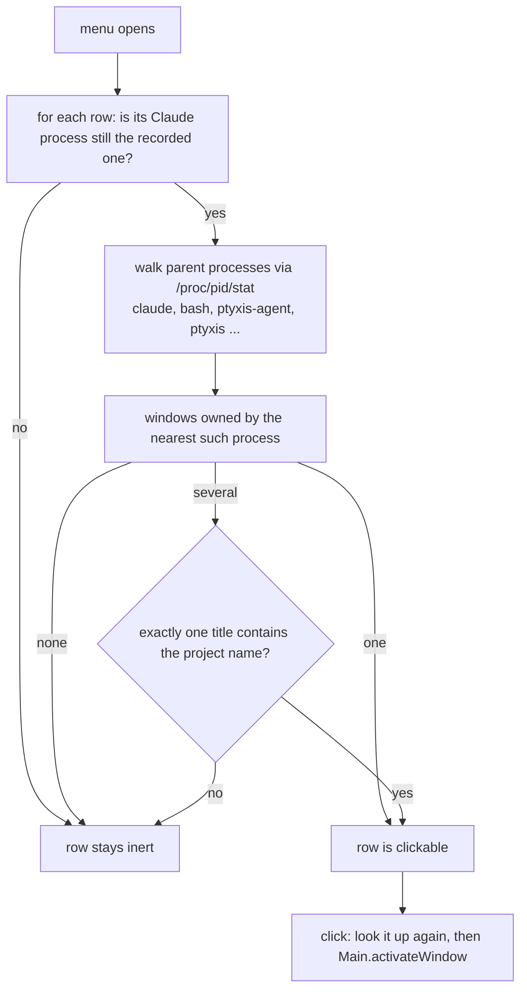
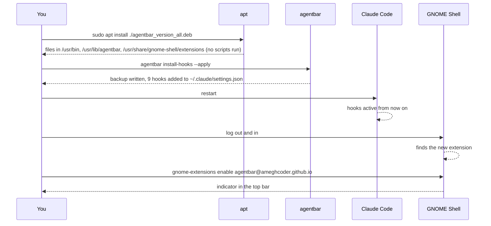
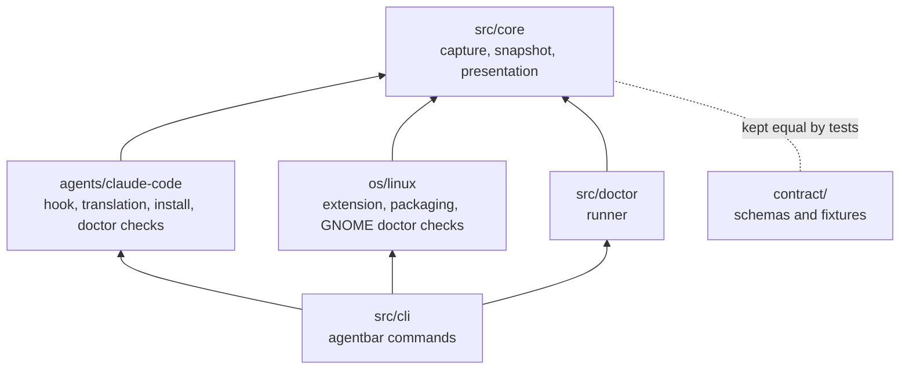

# How AgentBar works

A guided tour for developers, with diagrams. It explains the flow from a
Claude Code hook to the pixels in the top bar. The exact rules (priorities,
thresholds, edge cases) live in [architecture.md](architecture.md), and the
reasons behind them in the [decision records](adr/). Building and running a
checkout is covered in [development.md](development.md).

## The idea in one paragraph

Claude Code runs a small command, a **hook**, at moments that matter: before
and after a tool runs, when it needs permission, when a turn ends. AgentBar's
hook turns each of those into one normalized event and saves the current
state of every session in one local JSON file. A GNOME Shell extension
watches that file and draws it. The two halves never talk to each other: the
file is the whole contract ([ADR 0003](adr/0003-local-file-state-contract.md)).
So capture works even when the extension is off, and the extension shows
"State unavailable", never a guess, if the file is missing a piece it needs.

## The big picture

| Part | Language | Runs | Folder |
| --- | --- | --- | --- |
| Hook receiver and `agentbar` CLI | TypeScript on Node | Once per hook call, then exits | `agents/claude-code/`, `src/cli/` |
| Capture, snapshot, presentation | TypeScript, no GNOME imports | Inside the hook, and copied into the extension | `src/core/` |
| Extension | JavaScript (GJS) | Inside GNOME Shell, always | `os/linux/gnome-shell/` |
| Data contract | JSON Schema and fixtures | Read by tests and by future ports | `contract/` |

## One event, end to end

What happens when Claude asks for permission while you are in another window:

The hook takes about 50 ms, almost all of it Node starting. It never writes to
stdout and exits 1, never 2, on failure, so it can never block or approve
anything in Claude Code.

## Inside capture

Core never imports the Claude adapter; the adapter is passed in
(`CaptureAdapter`, [ADR 0007](adr/0007-os-agent-contract-repository-structure.md)).
That is the seam a second coding agent would plug into.

### Which hook becomes which state

| Claude Code hook | AgentBar state |
| --- | --- |
| `SessionStart` | Idle (an auto-compaction keeps the state it interrupted) |
| `PreToolUse`, `PostToolUse` | Working |
| `PostToolUseFailure` | Working: a failed command is routine |
| `Notification` (permission prompt) | Permission needed |
| `Notification` (idle prompt, input request) | Waiting for you |
| `PermissionRequest` | Permission needed; Waiting for you for `AskUserQuestion` |
| `Stop` | Turn complete |
| `StopFailure` | Failed |
| `SessionEnd` | Idle |

## Inside the extension

`presentation.js`, `snapshot.js`, and `vocabulary.js` are the compiled
TypeScript from `src/core`, copied into the extension at build time. The
extension and the Node tests run the exact same rules.

## Session states

Two things sit on top of these states. They are worked out when the view is
drawn and never saved:

- **No updates (stale).** Working, Waiting for you, or Permission needed with
  no event for 10 minutes. The top bar stops claiming the state, and the menu
  still shows what was last observed. A missing event is not evidence of
  anything ([ADR 0004](adr/0004-observable-states-only.md)).
- **Ended.** The Claude process recorded with the session is gone, or its PID
  now belongs to another process ([ADR 0008](adr/0008-agent-process-liveness.md)).
  It is never attention, never notifies, and leads the top bar only when every
  session has ended.

## Which session the top bar shows

## Clicking a session

Terminals such as Ptyxis and GNOME Terminal, and VS Code, run every window from
one process, hence the title check. AgentBar never brings forward a window it
is unsure of. Window titles are only compared, never logged or stored.

## Installing, and when things take effect

The package deliberately does nothing per user: it never edits your settings,
enables the extension, or touches your home folder
([ADR 0006](adr/0006-deb-distribution.md)). The hooks name `/usr/bin/node`
and the installed receiver by absolute path, so they work from any project
and are unaffected by Node version managers.

## Where the code lives

Arrows point at what a folder may import. `test/layout.test.mjs` fails the
build if code crosses these lines: core never imports an agent or an OS
folder, and agents and OS folders never import each other.

## Where to change what

| You want to | Look at |
| --- | --- |
| Map a Claude hook to a different state | `agents/claude-code/translate.ts`, then the payload fixtures in `agents/claude-code/fixtures/` |
| Change wording, priority, the stale threshold, or notifications | `src/core/presentation.ts`, then `contract/presentation.json` and `contract/fixtures/` |
| Change what is saved | `src/core/snapshot.ts` and `contract/state.schema.json`; an incompatible change needs a new `schemaVersion` and an ADR |
| Change how the top bar or menu looks | `os/linux/gnome-shell/extension.js` and `stylesheet.css` |
| Change how the file is watched | `os/linux/gnome-shell/lib/state-reader.js` |
| Add another coding agent | [agents/README.md](../agents/README.md) |
| Change the package | `os/linux/packaging/` |

After any change: `pnpm typecheck` and `pnpm test`. Extension changes also
need a nested GNOME Shell or a logout and login; see
[development.md](development.md).
